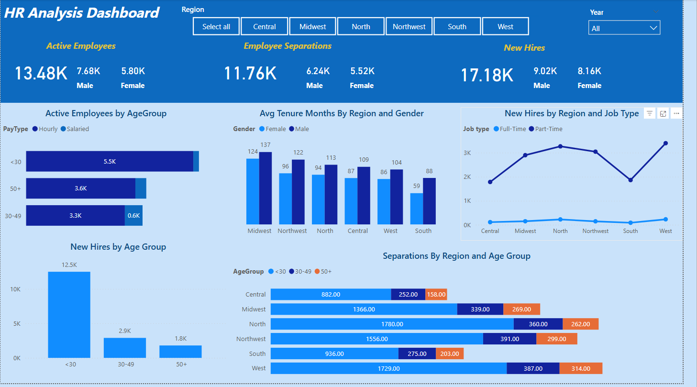
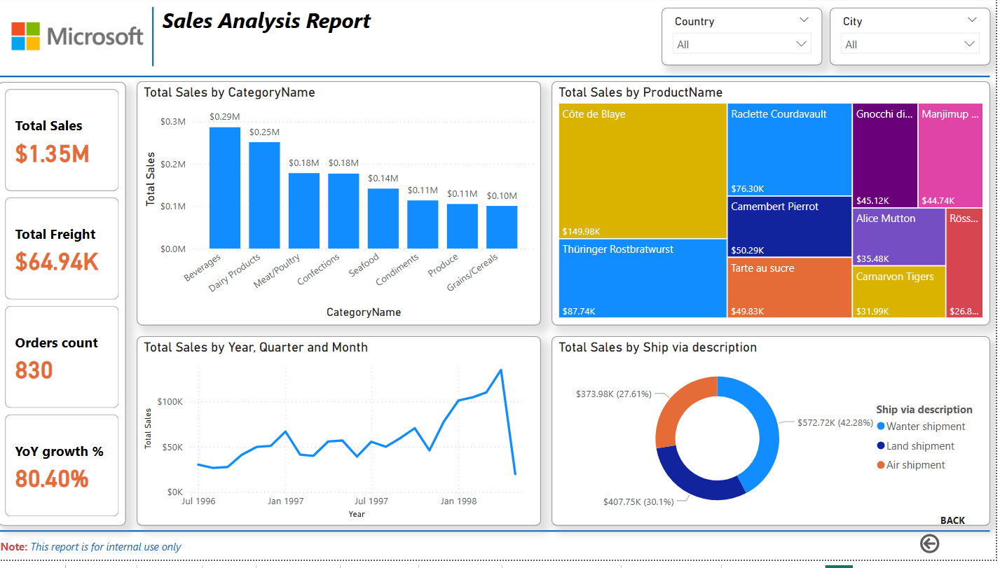
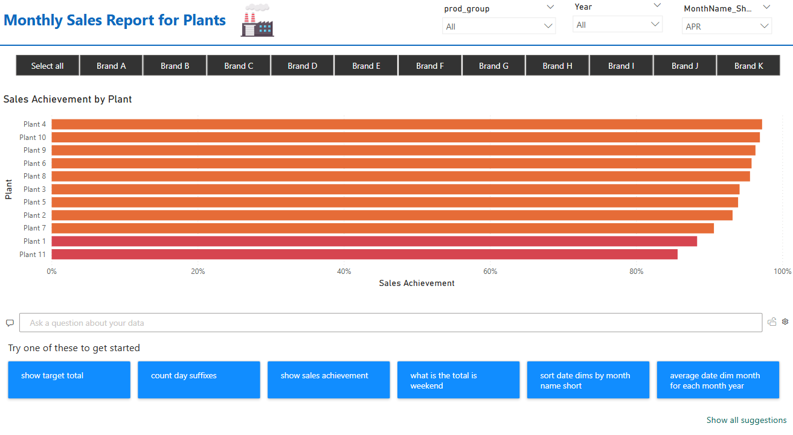
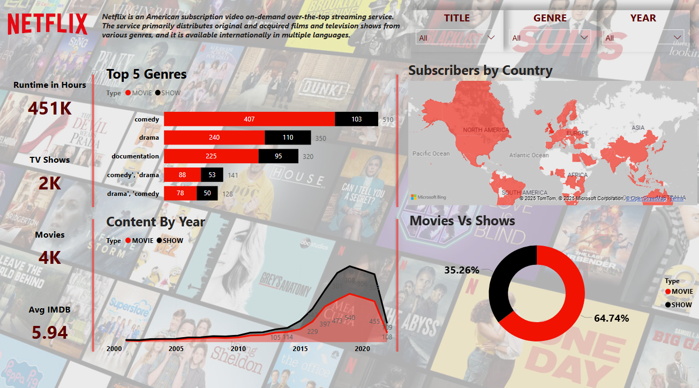
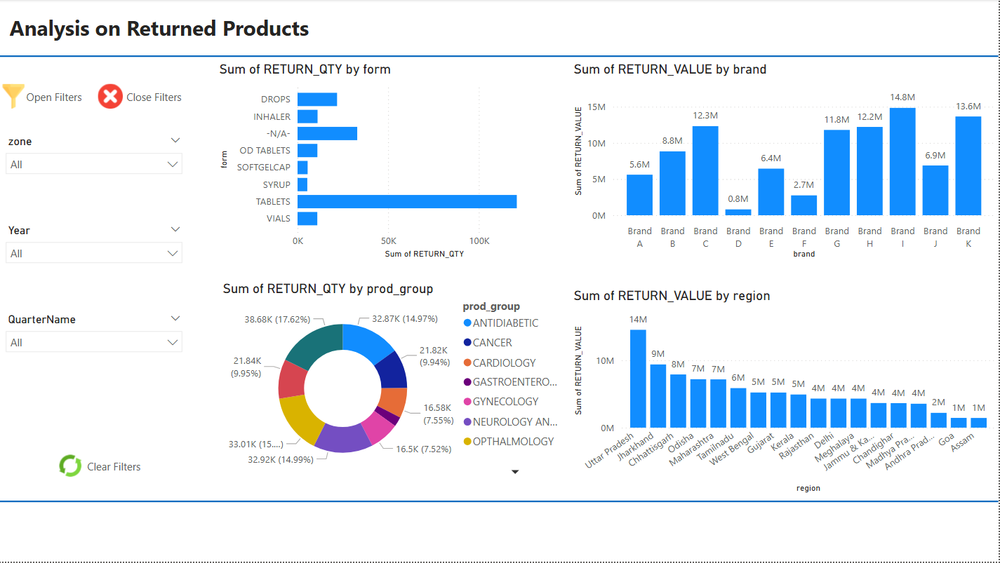
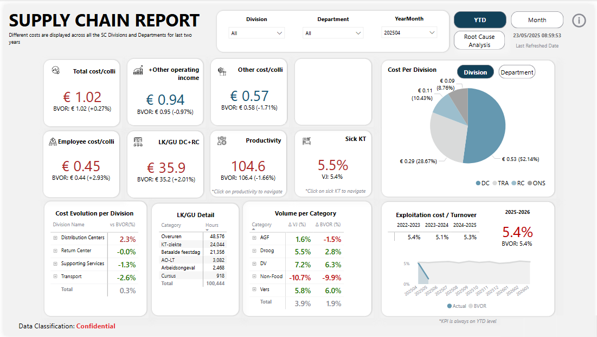

# 📊 Power BI Portfolio

## Business Intelligence & Data Analytics Dashboards

---

## 🎯 Overview

Welcome to my comprehensive Power BI portfolio showcasing expertise in business intelligence, data visualization, and strategic analytics across various industries. This collection demonstrates proficiency in creating interactive dashboards that drive data-driven decision making.

### 📈 Portfolio Statistics
- **6** Complete Interactive Dashboards
- **5** Industries Covered (HR, Sales, Manufacturing, Entertainment, Healthcare)
- **25+** Key Performance Indicators (KPIs) Tracked
- **100%** Interactive and Drill-Down Capable

---

## 🏢 Project Portfolio

### 1. 👥 HR Analysis Dashboard
*Human Resources Analytics & Workforce Intelligence*

#### Overview
Comprehensive human resources analytics dashboard providing insights into workforce demographics, employee separations, new hires, and tenure analysis across different regions and age groups.

#### Key Metrics
- **Active Employees**: 13.48K (7.68K Male, 5.80K Female)
- **Employee Separations**: 11.76K tracked
- **New Hires**: 17.18K with demographic breakdown
- **Regional Coverage**: 6 regions analyzed

#### Features
- ✅ Real-time headcount tracking and monitoring
- ✅ Gender diversity analysis with regional breakdown
- ✅ Employee separation trends and pattern analysis
- ✅ New hire metrics segmented by age groups
- ✅ Average tenure analysis by region and gender
- ✅ Interactive age group filtering (<30, 30-49, 50+)

#### Technologies Used

---

### 2. 💰 Sales Analysis Report
*Revenue Analytics & Performance Tracking*

#### Overview
Microsoft sample data-based sales dashboard featuring comprehensive revenue analysis, category performance, product insights, and shipping analytics with impressive growth tracking.

#### Key Metrics
- **Total Sales**: $1.35M
- **Total Freight**: $64.94K
- **Orders Count**: 830
- **YoY Growth**: 80.40%

#### Features
- ✅ Multi-category revenue analysis (Beverages, Dairy Products, Meat/Poultry)
- ✅ Product performance with top performers identification
- ✅ Time-series analysis covering 1996-1998 period
- ✅ Shipping method distribution analysis
- ✅ Quarterly and monthly trend visualization
- ✅ Interactive treemap for product insights

#### Technologies Used

---

### 3. 🏭 Manufacturing Plants Report
*Plant Performance & Sales Achievement Analytics*

#### Overview
Plant-wise sales achievement analysis for manufacturing operations, showcasing performance metrics across 11 different plants with comprehensive brand analysis and filtering capabilities.

#### Key Metrics
- **Plants Analyzed**: 11 manufacturing facilities
- **Brand Coverage**: Brands A through K
- **Achievement Tracking**: Percentage-based performance metrics
- **Time Periods**: Monthly and yearly analysis

#### Features
- ✅ Comprehensive plant performance comparison (Plants 1-11)
- ✅ Sales achievement percentage tracking with benchmarks
- ✅ Multi-brand analysis across 11 different brands
- ✅ Advanced filtering by month, year, and product groups
- ✅ Interactive Q&A functionality for ad-hoc analysis
- ✅ Performance ranking and identification of top/bottom performers

#### Technologies Used

---

### 4. 🎬 Netflix Analytics Dashboard
*Entertainment Industry Content Analysis*

#### Overview
Entertainment industry analytics showcasing Netflix content analysis with runtime tracking, genre distribution, content evolution timeline, and global subscriber insights with geographical mapping.

#### Key Metrics
- **Runtime Hours**: 451K total content hours
- **TV Shows**: 2K series available
- **Movies**: 4K films in catalog
- **Average IMDB Rating**: 5.94

#### Features
- ✅ Comprehensive genre analysis (Comedy: 510, Drama: 350, Documentary: 320)
- ✅ Content type distribution (Movies: 64.74% vs TV Shows: 35.26%)
- ✅ Historical content evolution timeline (2000-2020)
- ✅ Global subscriber geographical mapping
- ✅ Top 5 genres with movie/show breakdown
- ✅ Content release year trend analysis

#### Technologies Used

---

### 5. 📦 Product Returns Analysis
*Returns Management & Quality Control Dashboard*

#### Overview
Comprehensive returns management dashboard analyzing return patterns by product form, brand performance, regional distribution, and pharmaceutical product categories with detailed breakdowns.

#### Key Features Analyzed
- **Product Forms**: Tablets, Drops, Inhalers, Vials, etc.
- **Brand Coverage**: 11 major brands (A through K)
- **Medical Categories**: 7 specialties including Cardiology, Cancer, Neurology
- **Geographic Coverage**: 15+ regions analyzed

#### Features
- ✅ Return quantity analysis by product form and type
- ✅ Brand-wise return value tracking across 11 brands
- ✅ Regional return distribution with geographic insights
- ✅ Medical specialty categorization (Antidiabetic, Cancer, Cardiology, etc.)
- ✅ Multi-dimensional filtering by zone, year, and quarter
- ✅ Return rate percentage calculations and trends

#### Technologies Used

---

### 6. 🚚 Supply Chain Report
*Operational Efficiency & Cost Analysis*

#### Overview
Advanced supply chain analytics dashboard featuring comprehensive cost analysis, operational efficiency metrics, productivity tracking, and division-wise performance indicators.

#### Key Metrics
- **Total Cost/Unit**: €1.02 (BVOR: €1.02, +0.27%)
- **Employee Cost/Unit**: €0.45 (BVOR: €0.44, +2.93%)
- **Productivity Index**: 104.6 (BVOR: 106.4, -1.66%)
- **Sick Leave Rate**: 5.5% (vs 5.4% target)

#### Features
- ✅ Comprehensive cost per unit analysis with variance tracking
- ✅ Division-wise performance breakdown (DC, TRA, RC, ONS)
- ✅ Employee productivity and cost efficiency metrics
- ✅ LK/GU detailed operational breakdown
- ✅ Category-wise volume analysis with growth percentages
- ✅ Year-over-year exploitation cost trends (5.4% growth rate)

#### Technologies Used

---

## 🛠️ Technical Skills Demonstrated

### Power BI Expertise
- **Advanced DAX Functions**: Complex calculations and measures
- **Data Modeling**: Star schema implementation and relationships
- **Interactive Visualizations**: Drill-through, bookmarks, and dynamic filtering
- **Custom Visuals**: Integration of third-party and custom visualizations
- **Performance Optimization**: Query optimization and data refresh strategies

### Analytics Capabilities
- **KPI Development**: Strategic metric identification and tracking
- **Trend Analysis**: Time-series analysis and forecasting
- **Comparative Analysis**: Benchmarking and variance analysis
- **Geographic Analysis**: Spatial data visualization and mapping
- **Statistical Analysis**: Descriptive and inferential statistics

### Data Visualization Best Practices
- **User Experience Design**: Intuitive navigation and layout
- **Color Psychology**: Strategic use of colors for data storytelling
- **Information Hierarchy**: Logical flow and visual hierarchy
- **Accessibility**: Color-blind friendly palettes and clear labeling
- **Mobile Responsiveness**: Cross-device compatibility

---

## 📞 Contact & Collaboration

### Let's Connect!
I'm always interested in discussing data analytics, business intelligence, and potential collaboration opportunities.

### Available for:
- **Consulting Projects**: Business intelligence implementation
- **Dashboard Development**: Custom Power BI solutions
- **Training & Workshops**: Power BI and analytics training
- **Speaking Engagements**: Data visualization best practices
- **Collaboration**: Open-source BI projects

---

## 📝 License

This project is licensed under the MIT License - see the [LICENSE](LICENSE) file for details.

---

## 🙏 Acknowledgments

- **Microsoft Power BI Team** for the excellent platform
- **Power BI Community** for continuous learning resources
- **Sample Data Providers** for realistic datasets
- **Open Source Contributors** for visualization inspirations

---

## ⭐ Show Your Support

If you found this portfolio helpful or inspiring, please consider:
- ⭐ **Starring this repository**
- 🍴 **Forking for your own projects**
- 📢 **Sharing with your network**
- 💬 **Providing feedback and suggestions**

---

*Last Updated: May 2025*

---

**Happy Analyzing! 📊✨**
